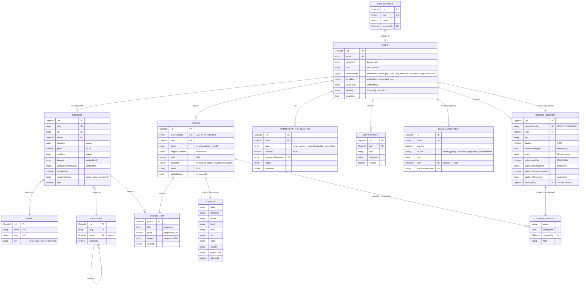

# 02 — Entity Relationship Diagram

## Mermaid ERD



## Relationship notes

### One-to-many (typical)
- `User → Order` — a user has many orders
- `User → SpecialRequest` — a user submits many requests
- `User → MembershipTransaction` — billing history
- `Brand → Product`, `Category → Product`

### Many-to-many
- `User ↔ Product` (wishlist): stored as `user.wishlist[ObjectId<Product>]` — denormalised on the user side. For large wishlists, may need a separate `Wishlist` collection, but unlikely at this scale.

### Self-referential
- `Category.parent → Category._id` (nested categories: Women → Bags → Top-handle)

### Embedded vs. referenced — the decision rule
- **Embedded** when child has no independent lifecycle and is bounded:
  - `Order.items` (snapshot of product at purchase time — must not change if product is edited later)
  - `Order.statusHistory`, `SpecialRequest.statusHistory`
  - `User.addresses`, `User.wishlist`
  - `Product.images`, `Product.authenticationDetails`
- **Referenced** when child is queried independently or grows unbounded:
  - `Product.brand`, `Product.category`
  - `Order.user`, `SpecialRequest.user`
  - `MembershipTransaction.user`

### Critical snapshot pattern
`Order.items[].price` and `Order.items[].title` are **snapshots at purchase time**, NOT live joins to Product. If a product price changes after sale, the order total must still reflect what the customer paid. Same for `Order.shippingAddress` — copy from User.addresses, don't reference.

## Required indexes

```js
// User
{ email: 1 }                                       // unique, login
{ 'membership.endDate': 1, 'membership.status': 1 } // cron expiry sweep
{ emailVerifyToken: 1 }, { passwordResetToken: 1 } // sparse

// Product
{ slug: 1 }                                        // unique, detail page
{ sku: 1 }                                         // unique
{ category: 1, isPublished: 1, createdAt: -1 }     // browse + filter
{ brand: 1, isPublished: 1 }
{ requiresAddon: 1, isPublished: 1 }
{ isFeatured: 1, isPublished: 1 }
{ title: 'text', description: 'text', tags: 'text' } // search

// Order
{ orderNumber: 1 }                                 // unique
{ user: 1, createdAt: -1 }                         // user's order history
{ status: 1, createdAt: -1 }                       // admin filter
{ 'payment.paystackReference': 1 }                 // webhook lookup

// SpecialRequest
{ requestNumber: 1 }                               // unique
{ user: 1, createdAt: -1 }
{ status: 1 }

// MembershipTransaction
{ user: 1, createdAt: -1 }
{ paystackReference: 1 }                           // unique, webhook lookup

// EmailSubscriber
{ email: 1 }                                       // unique
{ unsubscribeToken: 1 }
{ tags: 1, isActive: 1 }                           // campaign segmentation

// SiteSettings
{ key: 1 }                                         // unique
```

## Schema validation strategy

Use Mongoose schemas as the canonical source. Joi/Zod validators at the API boundary mirror the model but apply *input* rules (required-on-create vs. optional-on-update). Never trust the model alone — Mongoose `unique: true` is a hint, not a constraint without an index sync.
